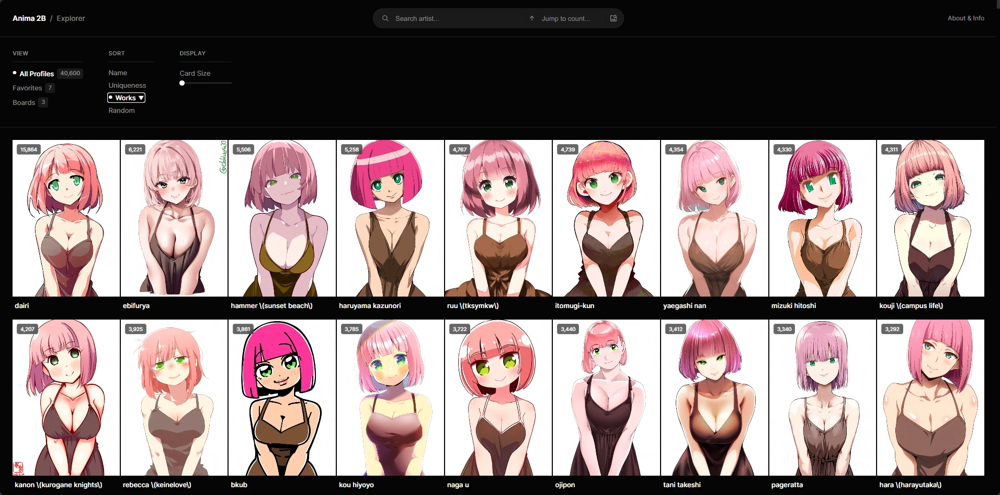
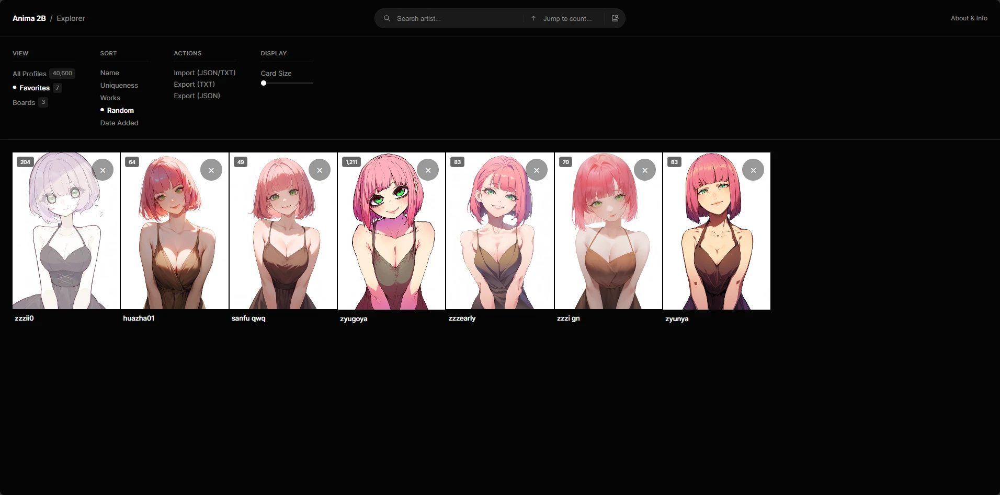
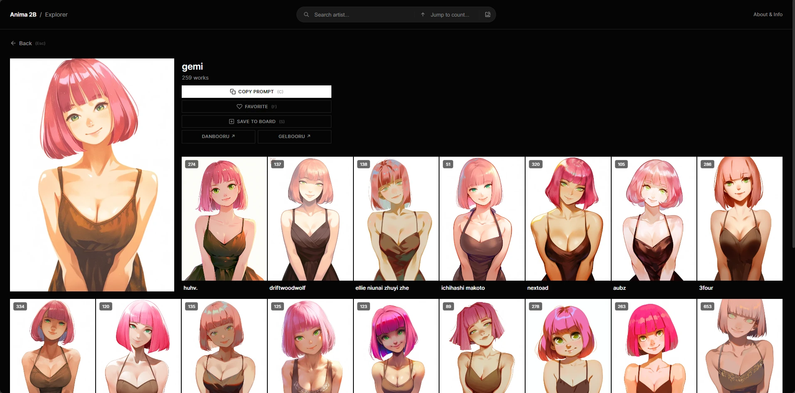
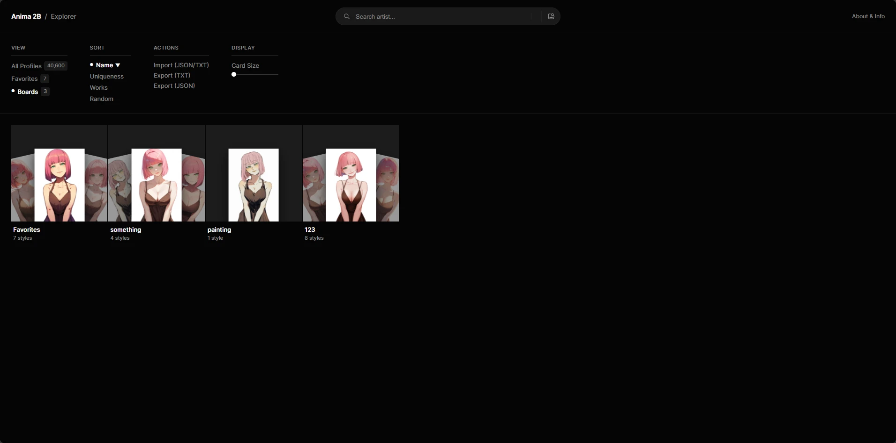
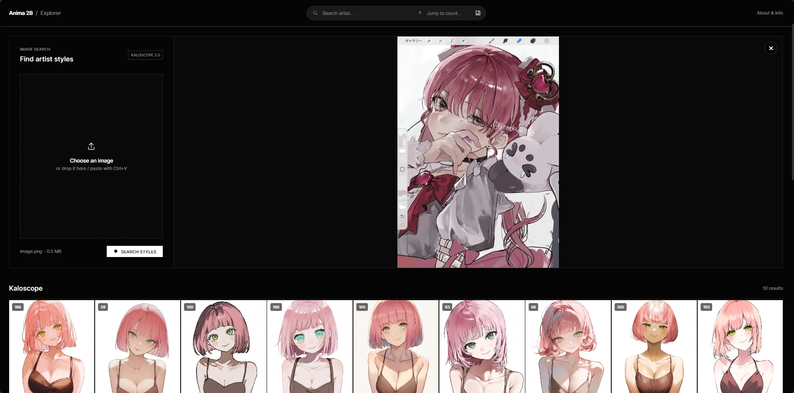

# Anima 2B Style Explorer 🎨

Anima 2B Style Explorer shows how the Anima 2B parameter model draws 40,000 artists from the Danbooru dataset.

<p align="center">
  
</p>
<p align="center">
  
</p>
<p align="center">
  
</p>
<p align="center">
  
</p>
<p align="center">
  
</p>

## Overview
This tool helps you see how the Anima 2B model interprets an artist style before you generate an image. We generated each preview image with the prompt `1girl, artist_name`.

## Features
- **40,000 Styles:** Browse the artists in a responsive grid.
- **Search and Filter:** Search by artist name or jump to a popularity rank.
- **Sort:** Order the gallery by Name, Works (dataset popularity), Uniqueness, Date, or Random.
- **Favorites:** Save artists to your personal list. The browser saves this list in IndexedDB.
- **Folder Organization:** Group your favorite artists into folders. Use `Ctrl+Click` to select multiple artists. 
- **Similar Artists:** Find artists with a related style.
- **Import and Export:** Backup your favorites to a JSON file. Export a TXT list for your prompts.
- **Grid Layout:** Change the grid from 4 to 10 columns with the slider or number keys (`4`-`0`).

## Navigation and Hotkeys
- **Arrow Keys:** Move the focus across the grid.
- **Double-click / Double-tap / F:** Add the artist to your favorites.
- **Middle-click / Space:** Open the QuickLook preview.
- **Scroll Wheel / Arrow Keys:** Switch photos in the QuickLook preview.
- **C / Left-click:** Copy the artist name to the clipboard.
- **Enter:** Open the Similar Artists panel.
- **Escape:** Close the active window.

## Offline Usage
You can run this tool locally. By default, the application size is under 5MB because images stream from Hugging Face.
1. Download the ZIP file or clone the repository:
```bash
git clone https://github.com/Kellenok/animterest.git
```
2. Extract the files if downloaded as ZIP.
3. Open `index.html` in your web browser.

Note: By default, images and similar artists data load from the Hugging Face dataset `Kellenok/anima` and require an internet connection (though they are automatically cached via a Service Worker).

**Full Offline Mode:**
If you want to use the application completely offline, you can clone the dataset directly into the project folder:
1. Inside the project folder, run:
```bash
git clone https://huggingface.co/datasets/Kellenok/anima
```
2. The application will automatically detect the local `anima` folder and load all images and similar artist data directly from your local drive.

## Technical Stack
- **Core Model:** Anima 2B
- **Tagging System:** Danbooru
- **Frontend:** HTML5, CSS3, Vanilla JavaScript

## Acknowledgments
- CircleStone Labs for the Anima 2B model.
- Danbooru community for the tags.

## License
This project is an open-source visual guide for educational and artistic reference.
